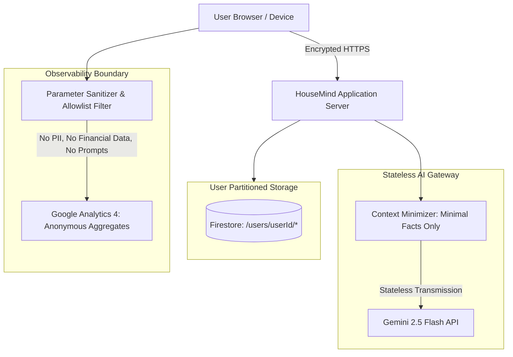

# HouseMind Privacy Architecture & Data Governance

> **Privacy Commitment:** Tenant Partitioning, Minimal AI Context, Human-in-the-Loop Review & Aggregate-Only Telemetry  
> **Applicable Version:** HouseMind v2.5.0

---

## 1. Privacy Philosophy & Data Boundaries

HouseMind is built on the principle that your home is your most private space, and your household operational and financial data belongs exclusively to you. The platform enforces strict structural boundaries between user data, AI processing, observability telemetry, and third-party services.

---

## 2. Household Data Storage & Isolation

1. **Per-Tenant Storage Partitioning**:
   All household profile data, properties, rooms, assets, maintenance logs, warranties, issues, recurring expenses, loans, credit cards, ledger transactions, and documents are stored under a strict tenant partition keyed by your authenticated user ID (`/users/{userId}/*`).
2. **No Cross-User Aggregation**:
   Your personal household records are never merged into shared data pools, public indexes, or cross-tenant datasets.
3. **Source Provenance Tracking**:
   Every record maintains provenance metadata (`SourceMetadata`) identifying whether the record was created via manual entry, file upload, or showcase sample seed (`isDemo: true`).

---

## 3. Grounded AI Context Minimization & Processing Boundary

When you interact with the Household Agent or Copilot, HouseMind adheres to strict data minimization protocols:

- **Ephemeral Context Assembly**: Prompts are not continuously sent with your entire household database. Instead, the Agent Orchestrator selects only the minimal set of structured records necessary to answer the specific query (e.g., querying maintenance tasks only when discussing repairs).
- **Stateless AI Processing**: Data transmitted to the Gemini API is processed statelessly to generate the immediate completion. Under Google's API developer terms, customer data processed via the Gemini API is not used to train Google models.
- **Sensitive Field Stripping**: Account numbers, passwords, credit card Primary Account Numbers (PANs), and government identifiers are masked or stripped prior to prompt compilation.
- **No Autonomous Financial or Destructive Actions**: The AI model cannot initiate financial transfers, delete accounts, or alter records without explicit user confirmation in the interface.

---

## 4. Document Processing & Human-in-the-Loop Staging

HouseMind processes uploaded household documents (invoices, receipts, warranty certificates, utility bills) through a transparent **two-stage staging pipeline**:

1. **Staging (`pending_review`)**: Uploaded documents are parsed to extract candidate metadata (vendor, date, total amount, category). These candidates remain in a non-binding staging state and do not affect your financial ledger or asset records.
2. **Review & Editing**: You can inspect, modify, or reject any candidate extraction via the Document Manager review interface.
3. **Commitment (`confirmed`)**: Only when you explicitly click **Confirm** are the verified figures committed to your live financial ledger.
4. **Immediate Deletion**: If you delete an uploaded document, its associated staged candidates are permanently purged.

---

## 5. Privacy-Preserving Telemetry & Observability

HouseMind utilizes Google Analytics 4 (standard free tier) strictly for high-level aggregate application health and feature adoption metrics. The telemetry pipeline (`src/lib/analytics.ts`) implements rigorous client-side and server-side privacy boundaries:

### What Is Strictly Excluded from Analytics:
- **Zero Financial Data**: Monetary amounts, balances, EMIs, interest rates, salaries, and transaction values are strictly stripped.
- **Zero Document Text**: File names, invoice details, OCR extracts, and document text are rejected.
- **Zero Prompts or Queries**: Raw user chat prompts, Copilot responses, and global search queries are never sent to analytics.
- **Zero Personally Identifiable Information (PII)**: Names, physical street addresses, email addresses, phone numbers, and Firebase Auth UIDs are excluded. The telemetry client uses an anonymous client-side session identifier.
- **Zero IP Storage**: IP addresses are not stored by the application logging layer.

### What Is Tracked (Aggregate Only):
- Anonymous page/screen view transitions (e.g., `view_dashboard`, `view_assets`)
- High-level feature engagement counts (e.g., `feature_used: "what_if_simulator"`)
- General application error codes (e.g., `ERROR_RATE_LIMIT_EXCEEDED`) for operational stability

---

## 6. User Data Governance & Deletion Controls

HouseMind provides clear, accessible controls within the **Privacy Center** (`Profile > Privacy & Data Controls`):

1. **Surgical Demo Data Removal (`POST /api/household/demo-remove`)**:
   If you explored the platform using the starter showcase dataset, you can surgically purge all sample records (`isDemo: true`) with a single click. Any personal properties, expenses, or assets you added yourself remain completely untouched.
2. **Complete Account Wipe (`POST /api/household/reset-data`)**:
   You can delete your entire household record collection at any time. To prevent accidental loss, this action requires typing an explicit confirmation phrase (`DELETE ALL DATA`). Once confirmed, all documents, properties, assets, transactions, and settings are permanently erased from the database.
3. **Document Purging**:
   Individual uploaded files and their extracted candidate records can be permanently deleted at any time from the Documents view.

---

## 7. Security of Data in Transit and at Rest

- All network traffic between client browsers, reverse proxies, application servers, and Google Cloud APIs is encrypted using modern TLS (HTTPS).
- Data at rest in Google Cloud Firestore and Google Cloud Secret Manager is encrypted using Google Cloud's default 256-bit Advanced Encryption Standard (AES-256).
