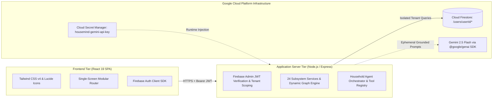

# HouseMind — Household Operating System & Grounded Intelligence Platform

> **A full-stack operational substrate that connects physical properties, appliances, warranties, maintenance, utilities, recurring obligations, loans, documents, and family cash flows into a single connected operational graph.**

[](https://www.typescriptlang.org/)
[](https://react.dev/)
[](https://expressjs.com/)
[-success.svg)](docs/TESTING.md)
[](https://ai.google.dev/)
[](SECURITY.md)

---

## 1. What is HouseMind?

Modern households are complex micro-enterprises. A typical family manages a physical structure, dozens of appliances with varying lifespans, manufacturer warranties, recurring maintenance schedules, utility meters, insurance policies, amortized mortgages, credit lines, and piles of invoices.

Yet, existing consumer software forces families into fragmented silos:
- **Banking apps** track money, but don't know when an air conditioner was last serviced.
- **Notes & cloud folders** store warranty PDFs, but fail to alert you when coverage is about to expire.
- **Maintenance checklists** track chores, but can't calculate whether repairing an old water heater is financially viable versus replacing it.
- **Generic AI chatbots** answer questions with guesses because they lack access to the factual state of your home.

**HouseMind solves this fragmentation.** It provides an integrated **Household Operating System** that bridges the physical, financial, and operational realities of homeownership.

```text
Household Data (Physical Assets, Invoices, Service Logs, Debt Contracts)
      ↓
Structured Records (Properties, Rooms, Assets, Warranties, Expenses, Loans)
      ↓
Relationships (LOCATED_IN, COVERED_BY, SERVICED_BY, BILLED_UNDER, etc.)
      ↓
Deterministic Intelligence (Health Scoring, Amortization Math, Gap Analysis)
      ↓
Grounded AI (Gemini Synthesis with Grounded Tools & Ephemeral Context)
      ↓
Actionable Household Decisions (Unified Actions, Morning Brief, Scenario Models)
```

---

## 2. Key Capabilities Across 24 Household Domains

HouseMind organizes household management into three core operational pillars:

### I. Physical Home Infrastructure
- **Property & Room Hierarchy**: Multi-property management with room-level asset mapping, square footage tracking, and climate benchmarks.
- **Asset Lifecycle Management**: Complete equipment registry (HVAC, plumbing, electrical, roofing, appliances) tracking age, condition score, expected lifespan, and estimated replacement costs.
- **Warranties & Coverage**: Manufacturer and extended warranty tracking with expiration alerts and claim contact details linked to physical equipment.
- **Preventative Maintenance**: Recurring service schedules, task logs, vendor details, and overdue service alerts.
- **Universal Issues & Tickets**: Problem lifecycle management (reported, in-progress, resolved) with contractor estimates and safety hazard detection (gas, electrical, water).

### II. Financial Infrastructure & Cash Flow
- **Unified Financial Ledger**: Comprehensive transaction tracking classifying entries into Credits, Debits, and Transfers, preventing double-counting and calculating true net cash flow.
- **Recurring Expenses**: Fixed household obligations (property taxes, insurance, HOA fees, subscriptions) normalized by payment frequency.
- **Mortgages & Amortized Loans**: Principal balances, interest rates, monthly EMI breakdowns, and lifetime interest projections.
- **Credit Cards & Utilization**: Statement cycles, credit limits, current balances, and credit utilization safety thresholds.
- **Staged Document Intelligence**: Ingests invoices, statements, and receipts through a transparent two-stage review pipeline (`pending_review` -> human edit -> `confirmed`) with SHA-256 duplicate detection.

### III. Grounded Intelligence & Decision Support
- **Cross-Domain Relational Graph**: An in-memory tenant relationship graph connecting physical assets, warranties, tickets, and expenses (`LOCATED_IN`, `COVERED_BY`, `SERVICED_BY`, `REPORTED_ON`, `BILLED_UNDER`, `ATTACHED_TO`, `PART_OF`).
- **Household Health Index**: A real-time 0–100 operational score calculated across 4 pillars: Financial Safety, Asset Condition, Maintenance Readiness, and Issue Urgency.
- **Command Center Cockpit**: Executive dashboard spotlighting immediate action items, priority alerts, upcoming deadlines, and cash runway.
- **Daily Morning Briefing**: A concise 4-part daily summary (Urgent Alerts, Today's Deadlines, Health Score, Proactive Recommendation) with direct action deep-links.
- **Grounded Copilot & Agent**: Conversational partner powered by 13 deterministic read tools, strict sandboxing against destructive mutations, and deterministic fallback guarantees.
- **What-If Scenario Simulator**: Simulates high-impact home decisions (e.g. replacing an aging HVAC vs paying down loan debt) projecting 12-month net cash flow impact before committing capital.

---

## 3. The Grounded AI Differentiator

> **HouseMind never asks Gemini to guess or calculate household facts.**

```text
Authenticated Household
        ↓
Household Context (Minimal Ephemeral Facts)
        ↓
Deterministic Facts (Factual Balances, Lifespan Math, Expiration Dates)
        ↓
Relationships / Intelligence (Cross-Domain Graph Traversal)
        ↓
Grounded Read Tools (get_assets, get_issues, get_warranties, ...)
        ↓
Gemini 2.5 Flash Synthesis (Source-Grounded Natural Language Explanation)
        ↓
Action Proposal (Requires Human User Confirmation to Execute)
```

1. **Deterministic Calculation**: Financial arithmetic, EMI formulas, asset lifespans, and health scores are computed exclusively by verified deterministic TypeScript services.
2. **Ephemeral Context Minimization**: Only query-relevant records are assembled for prompt execution; full database dumps are never transmitted.
3. **Strict Mutation Sandbox**: Agent tools are strictly read-only. Destructive database operations cannot be triggered via conversation.
4. **Two-Stage Action Approval**: Any state changes proposed by the assistant (e.g. scheduling maintenance) require explicit user review and approval in the UI.
5. **Deterministic Continuity**: If upstream API quota is depleted, the platform falls back to deterministic rule-based narratives, ensuring 100% application uptime.

---

## 4. Realistic Showcase Scenario

To demonstrate how these domains interconnect in practice, HouseMind includes a realistic, localized showcase dataset (**The Sharma Household — Whitefield Villa, Bengaluru, India**):

- **The Physical Asset**: A 9-year-old `Daikin 2.0 Ton Inverter Split AC` located in the Living Room nearing its 10-year expected lifespan.
- **The Issue**: A recurring refrigerant leak ticket (`₹18,000` contractor repair estimate) logged against the unit.
- **The Compounding Risk**: The Cross-Domain Intelligence engine reveals that the warranty expired 14 months ago and historical repairs already total `₹24,500` (combined repair costs exceed 65% of the `₹65,000` replacement price).
- **The Actionable Outcome**: The Morning Brief flags this critical threshold and directs the homeowner to the **What-If Simulator**, projecting the 12-month net financial impact of replacement versus continuing emergency repairs.
- **Clean Sample Governance**: The starter dataset can be explored freely and surgically purged at any time (`Profile > Privacy & Data Controls > Remove Sample Data`) without altering user-created records.

---

## 5. System Architecture & Tech Stack



| Component | Technology | Version | Purpose |
| :--- | :--- | :--- | :--- |
| **Frontend** | React SPA | 19.0 | Fluid, accessible user interface with zero-slop design |
| **Backend** | Express on Node.js | 4.21 / 20+ | REST API, domain intelligence engines, and Vite middleware |
| **Type Safety** | TypeScript | 5.8 | End-to-end type safety with shared interfaces |
| **AI SDK** | `@google/genai` | 2.4.0 | Grounded Gemini Flash reasoning and multimodal extraction |
| **Auth & DB** | Firebase Auth & Firestore | 14.3 / 11.4 | RS256 token verification and per-tenant database isolation |
| **Secrets** | Google Cloud Secret Manager | Managed | Secure runtime injection with least-privilege IAM |
| **Styling** | Tailwind CSS & Lucide | 4.0 / 0.475 | Clean typography, mathematical spacing, accessible contrast |

---

## 6. Security & Privacy by Design

- **Tenant Isolation**: Every database operation is strictly scoped to `/users/{userId}/*`. Cross-tenant data access is structurally impossible.
- **Google Cloud Secret Manager**: Production API keys are resolved at runtime via Secret Manager (`housemind-gemini-api-key`). Zero credentials exist in client bundles, repository commits, or Docker layers.
- **SSRF Defense**: Outbound Firestore REST calls use validated constructors enforcing `https:`, trusted hostname `firestore.googleapis.com`, and strict ID regex (`SAFE_ID_REGEX`).
- **ReDoS Protection**: File parsers use a deterministic $O(n)$ linear-time parser (`parseDelimitedLine`), eliminating exponential backtracking risks.
- **Tiered Rate Limiting**: Sliding-window rate limiters throttle standard API calls (120 req/min), uploads (15 req/min), and AI synthesis (25 req/min).
- **Privacy Telemetry Boundary**: Standard Google Analytics 4 tracks aggregate adoption only. Monetary figures, balances, document text, search queries, and chat prompts are strictly stripped.

For detailed specifications, see [SECURITY.md](SECURITY.md) and [PRIVACY.md](PRIVACY.md).

---

## 7. Quick Start & Local Development

### Prerequisites
- Node.js 20.x or higher
- npm 10.x or higher

### Installation & Run

```bash
# 1. Clone the repository
git clone https://github.com/your-username/housemind.git
cd housemind

# 2. Install dependencies
npm install

# 3. Start development server (Port 3000)
npm run dev
```

The application will be accessible at `http://localhost:3000`.

---

## 8. Quality Assurance & Verification Suite

HouseMind includes an automated test harness covering all 24 domains:

```bash
# 1. Run the complete automated test suite (347 tests)
npm test

# 2. Run static type validation (Zero errors)
npm run lint

# 3. Run production build verification
npm run build
```

### Verified Test Results

```text
===============================================================
  TEST EXECUTION SUMMARY
===============================================================
  Total Tests Executed: 347
  Passed:               347 (100%)
  Failed:               0
  Execution Time:       30,130 ms (~30.1s)
===============================================================
ALL TESTS PASSED SUCCESSFULLY.
```

For the complete testing breakdown and Playwright browser journey specifications, consult [docs/TESTING.md](docs/TESTING.md).

---

## 9. Comprehensive Documentation Directory

| Document | Description |
| :--- | :--- |
| **[docs/ARCHITECTURE.md](docs/ARCHITECTURE.md)** | Full technical specification, 24 domain subsystems, dynamic graph model, and complete REST API reference |
| **[docs/TESTING.md](docs/TESTING.md)** | Testing philosophy, 38 test suites breakdown (347 tests), and Playwright browser journey suite |
| **[docs/USER-JOURNEYS.md](docs/USER-JOURNEYS.md)** | Detailed walkthroughs of the 6 end-to-end homeowner user workflows |
| **[SECURITY.md](SECURITY.md)** | Security architecture, STRIDE threat model, defense-in-depth, Secret Manager, and AI safety protocols |
| **[PRIVACY.md](PRIVACY.md)** | Data governance, context minimization, two-stage document staging, and telemetry boundaries |
| **[DEPLOYMENT.md](DEPLOYMENT.md)** | Production Cloud Run deployment guide, Secret Manager provisioning, Docker instructions, and secret rotation |
| **[CHANGELOG.md](CHANGELOG.md)** | Semantic release notes detailing platform milestones up to v2.5.0 |
| **[CONTRIBUTING.md](CONTRIBUTING.md)** | Code of conduct, development setup, code standards, and pull request workflow |
| **[docs/historical/AUDIT_REPORT.md](docs/historical/AUDIT_REPORT.md)** | Archived historical security audit and CodeQL remediation log |

---

## License

This project is licensed under the MIT License. See [LICENSE](LICENSE) for details.
