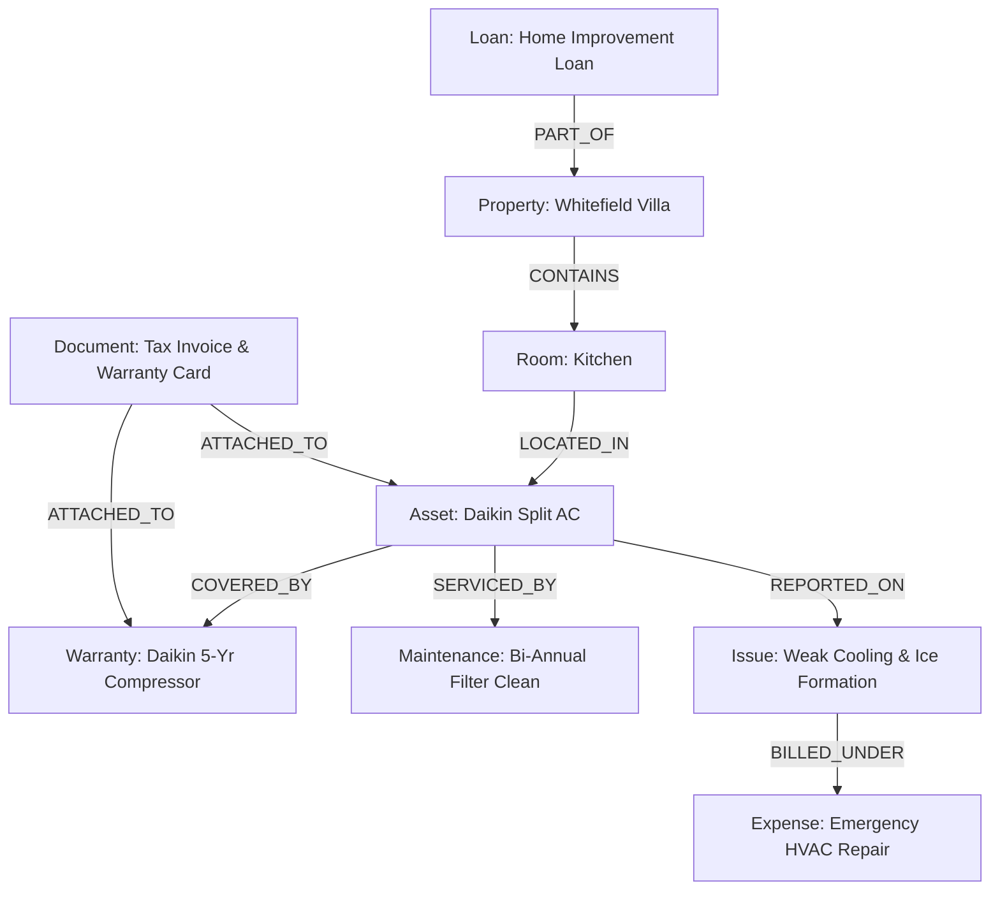
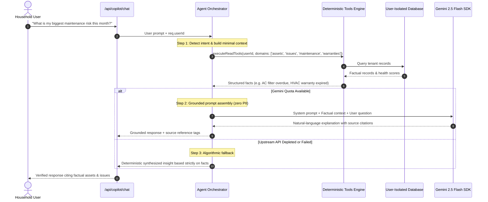

# HouseMind Architecture & Technical Specification

> **Version:** 2.5.0 • **Architecture:** Full-Stack Modular TypeScript (Express + React SPA) • **Engine:** Grounded Gemini Decision Intelligence & Deterministic Domain Engines

---

## 1. System Overview & Core Philosophy

**HouseMind** is a **Household Operating System and Household Intelligence Platform**. It is not merely a chatbot, a personal finance tracker, a maintenance checklist, or an OCR document scanner. It is a full-stack operational substrate that connects physical home properties, appliances, warranties, service records, utility meters, amortized debts, credit accounts, legal documents, and family cash flows into a unified, actionable intelligence model.

### The Operational Model

Traditional household tools operate in disconnected silos: bank apps track money without knowing when an air conditioner was serviced; notes apps store warranty PDFs without alerting you when an extended warranty is about to expire; chat interfaces answer questions with generic guesses because they lack access to factual household records.

HouseMind connects these domains through a multi-stage deterministic pipeline:

```text
Household Data (Physical Assets, Invoices, Service Logs, Debt Contracts)
      ↓
Structured Records (Properties, Rooms, Assets, Warranties, Expenses, Loans)
      ↓
Relationships (LOCATED_IN, COVERED_BY, SERVICED_BY, BILLED_UNDER, etc.)
      ↓
Deterministic Intelligence (Health Scoring, Amortization Math, Gap Analysis)
      ↓
Grounded AI (Gemini Synthesis with Grounded Tools & Ephemeral Context)
      ↓
Actionable Household Decisions (Unified Actions, Morning Brief, Scenario Models)
```

---

## 2. High-Level System Architecture

```mermaid
flowchart TB
    subgraph Client["Client Tier (React 19 SPA)"]
        UI[Navbar, Dashboard, Command Center]
        Views[Properties, Rooms, Assets, Issues, Warranties, Maintenance, Ledger, Debts, Calendar, Copilot, Simulator]
        ClientAuth[Firebase Auth Client SDK & Token Manager]
        Analytics[Privacy-Safe GA4 Telemetry Client]
    end

    subgraph Security["Perimeter & Security Layer"]
        Helmet[Helmet Security Headers & CSP]
        CORS[CORS Policy with Trusted Domain Patterns]
        RateLimit[Tiered Sliding-Window Rate Limiters]
        Sanitizer[Input Sanitizer & ReDoS-Safe Parser]
    end

    subgraph Server["Application Server Tier (Node.js / Express / TypeScript)"]
        AuthMiddleware[Firebase Admin Token Verification & Tenant Scope]
        Router[API Route Controllers: /api/household, /api/transactions, /api/copilot, ...]
        
        subgraph DomainServices["Deterministic Domain & Intelligence Services"]
            CC[Command Center & Health Engine]
            CD[Cross-Domain Graph & Insights Engine]
            UA[Unified Household Action Service]
            MB[Morning Brief Generator]
            II[Issue & Safety Intelligence Service]
            SE[What-If Scenario Simulation Engine]
            DE[Document Processing & Extraction Pipeline]
            FS[Financial Ledger & Cash Flow Service]
            GS[Global Search & Indexing Service]
            CS[Calendar & Notification Scheduler]
        end

        subgraph AgentSubsystem["Household Agent Orchestration Subsystem"]
            Orchestrator[Household Agent Orchestrator]
            ContextBuilder[Context Minimizer & Ephemeral Assembler]
            ToolExec[Tool Executor & Read Tools Registry]
            ActionExec[Action Proposal & Approval Engine]
            MemoryService[Household Memory & Preference Store]
        end
    end

    subgraph Storage["Isolated Storage Tier"]
        Firestore[(Google Cloud Firestore: /users/{userId}/*)]
        InMemStore[(Tenant-Scoped In-Memory Database Service)]
    end

    subgraph CloudServices["Google Cloud Platform Services"]
        SecretManager[Google Cloud Secret Manager: housemind-gemini-api-key]
        Gemini[Gemini Flash via @google/genai SDK]
        CloudRun[Cloud Run Container Environment]
    end

    Client -->|HTTPS + Bearer JWT| Security
    Security --> AuthMiddleware
    AuthMiddleware --> Router
    Router --> DomainServices
    Router --> AgentSubsystem
    DomainServices --> Storage
    AgentSubsystem --> DomainServices
    AgentSubsystem -.->|Stateless Ephemeral Prompt| Gemini
    SecretManager -.->|Runtime Injection| Server
```

---

## 3. Technology Stack & Runtime Topology

| Tier | Technology | Selected Packages | Architectural Role |
| :--- | :--- | :--- | :--- |
| **Frontend Framework** | React 19 (`react`, `react-dom`) | Functional components, hooks, React context | Client-side user interface rendering |
| **Language** | TypeScript 5.8 | Strict typechecking, shared domain types (`src/types.ts`) | Type safety across client and server |
| **Build & Dev Tooling** | Vite 6.2 & esbuild 0.25 | HMR, Rollup production bundling, CommonJS server bundle | Rapid local development and single-command production compilation |
| **UI Styling & Icons** | Tailwind CSS v4 & Lucide React | Curated Slate/Indigo/Emerald palettes, responsive layouts | Fluid, accessible, non-slop visual design |
| **Backend Runtime** | Node.js 20+ & Express 4.21 | Express router, custom middlewares | Modular REST API and static asset hosting |
| **AI SDK** | `@google/genai` (v2.4.0) | Gemini models (`gemini-2.5-flash`) | Grounded synthesis, structured extraction, scenario guidance |
| **Identity & Access** | Firebase Auth & Firebase Admin 14.3 | ID Token verification, tenant binding | Cryptographic per-user authentication |
| **Data Storage** | Google Cloud Firestore | Tenant-scoped hierarchies (`/users/{userId}/*`) | Cloud persistence with subcollection isolation |
| **Secrets Management** | Google Cloud Secret Manager | `--set-secrets="GEMINI_API_KEY=..."` | Secure runtime secret injection without files or env vars |
| **Security & Hardening** | `helmet`, `cors`, `express-rate-limit`, `zod` | Safe URL builders, linear-time parsers, upload limits | Defense-in-depth perimeter and input validation |
| **Telemetry & Observability**| Google Analytics 4 (standard/free tier) | `src/lib/analytics.ts` | Bounded aggregate telemetry strictly stripped of personal/financial data |

---

## 4. The 24 Core Domain Subsystems

HouseMind organizes household management into 24 cooperating subsystems:

```
+---------------------------------------------------------------------------------------------+
|                                    HOUSEMIND PLATFORM                                       |
+------------------------------+------------------------------+-------------------------------+
| PHYSICAL INFRASTRUCTURE      | FINANCIAL INFRASTRUCTURE     | INTELLIGENCE & COPILOT        |
| 1. Properties Management     | 7. Utilities & Meters        | 14. Household Health Engine   |
| 2. Room Spatial Hierarchy    | 8. Recurring Expenses        | 15. Command Center            |
| 3. Assets & Equipment        | 9. Loans & Amortized Debts   | 16. What-If Scenario Sim      |
| 4. Warranties & Coverage     | 10. Credit Cards & Limits    | 17. Cross-Domain Graph        |
| 5. Preventative Maintenance  | 11. Financial Transactions   | 18. Unified Actions Engine    |
| 6. Universal Issues/Tickets  | 12. Documents & Staging      | 19. Morning Brief Generator   |
|                              | 13. Cash Flow Projections    | 20. Household Agent/Copilot   |
+------------------------------+------------------------------+-------------------------------+
| OPERATIONAL CONTROLS & GOVERNANCE                                                           |
| 21. Global Search Engine     | 22. Calendar & Deadlines     | 23. Notifications & Alerts    |
| 24. Privacy Center & Local Data Controls                                                   |
+---------------------------------------------------------------------------------------------+
```

### Physical Infrastructure
1. **Properties**: Manages single-family, apartment, condo, or townhouse estates with square footage, primary heating types, address localization, and climate benchmarks.
2. **Rooms**: Hierarchical spatial grouping linking appliances, fixtures, and issues to physical locations within a home.
3. **Assets**: Tracks major physical equipment (HVAC, refrigerators, water heaters, roofs, solar inverters) with age, condition, purchase date, expected lifespan, and replacement costs.
4. **Warranties**: Tracks manufacturer warranties, extended protection plans, policy numbers, coverage end-dates, and provider details linked directly to physical assets.
5. **Maintenance**: Tracks recurring schedules (filter replacements, annual inspections, pipe flushing), historical service records, costs, and overdue alert statuses.
6. **Universal Issues & Tickets**: Lifecycle management for household problems (reported, in-progress, resolved) with severity ratings, contractor estimates, safety flags, and equipment linkage.

### Financial Infrastructure
7. **Utilities**: Tracks electricity, gas, water, internet, and trash accounts with billing cycles, meter reads, and usage anomalies.
8. **Expenses**: Manages recurring operational expenses (homeowner insurance, HOA fees, property taxes) with payment frequencies and auto-pay tracking.
9. **Loans**: Tracks amortized mortgages, home improvement loans, principal balances, interest rates, and monthly EMI payments.
10. **Credit Cards**: Tracks revolving household credit lines, statement cycles, utilization rates, and payment due dates.
11. **Financial Transactions**: Comprehensive ledger classifying transactions into Credits, Debits, and Transfers, preventing double-counting and computing net monthly cash flow.
12. **Documents & Staging**: Ingests invoices, statements, and receipts through a two-stage human-in-the-loop review pipeline (`draft` -> user edit -> `confirmed`).
13. **Cash Flow Projections**: Deterministic real-time calculation of net surplus, monthly burn rate, and discretionary savings buffer.

### Intelligence & Decisions
14. **Household Health Engine**: Computes a holistic 0–100 operational health score across 4 weighted pillars: Financial Safety, Asset Condition, Maintenance Readiness, and Issue Urgency.
15. **Command Center**: The primary cockpit highlighting immediate action items, priority alerts, financial run rates, and active issues.
16. **What-If Simulator**: Simulates high-impact home expenditures (e.g. replacing an HVAC vs paying down loan debt) calculating 12-month cash-flow impact without mutating live data.
17. **Cross-Domain Graph**: In-memory relational network connecting physical, operational, and financial nodes to discover compounding risks.
18. **Unified Household Actions**: Standardized action recommendations generated across all domains with deep links, priority scores, and human confirmation workflows.
19. **Morning Brief**: A 4-part daily operational summary (Urgent Alerts, Today's Deadlines, Health Metric, Proactive Tip) served with deterministic fallback guarantees.
20. **Household Agent / Copilot**: Multi-turn grounded conversational partner backed by deterministic read tools, structured memory, and strict mutation controls.

### Operational Controls
21. **Global Search**: Instant multi-domain index searching assets, expenses, tickets, loans, and documents in sub-5ms latency.
22. **Calendar**: Aggregates maintenance due dates, bill deadlines, warranty expirations, and scheduled contractor visits into a unified temporal view.
23. **Notifications**: In-app alert dispatch system prioritizing urgent equipment hazards and impending financial deadlines.
24. **Privacy Center & Data Controls**: Comprehensive transparency console displaying data storage footprint, source provenance, surgical demo data purging, and full account reset.

---

## 5. Cross-Domain Intelligence & Dynamic Graph Model

One of HouseMind's most significant technical differentiators is **Cross-Domain Relational Intelligence**.

### Dynamic In-Memory Graph Architecture
Rather than running an external graph database, HouseMind dynamically builds an **in-memory tenant relationship graph** directly from the authenticated user's structured database records inside `CrossDomainIntelligenceService`. This provides zero-latency graph traversal, total tenant isolation, and zero operational database overhead.



### Supported Edge Relationships

| Relationship | Source Domain | Target Domain | Real-World Meaning |
| :--- | :--- | :--- | :--- |
| `LOCATED_IN` | Asset / Issue | Room / Property | Defines the physical spatial location of an asset or problem |
| `COVERED_BY` | Asset | Warranty | Identifies contractual protection covering an asset's repair costs |
| `SERVICED_BY`| Asset | Maintenance | Links recurring preventative service routines to physical equipment |
| `REPORTED_ON`| Issue | Asset / Property | Links an operational ticket or failure to the specific asset |
| `BILLED_UNDER`| Issue / Maint | Expense / Tx | Maps maintenance or repair invoices to the financial ledger |
| `ATTACHED_TO`| Document | Asset / Warranty | Associates proof-of-purchase, invoices, or manual PDFs to entities |
| `PART_OF` | Room / Loan | Property | Structural containment of rooms or mortgages within a home |

### Compounding Insight Generation
By traversing edges across domains, HouseMind discovers compound risks that single-domain tools miss:

```text
Asset (12-yr-old HVAC)
  ↓ [REPORTED_ON]
Issue (Recurring refrigerant leak — 3rd occurrence in 18 months)
  ↓ [BILLED_UNDER]
Repair Invoices ($1,850 spent on past repairs)
  ↓ [COVERED_BY]
Warranty (Expired 2 years ago)
  ↓ [EVALUATION]
Cross-Domain Insight: Repair-vs-Replace threshold crossed (Repairs exceed 45% of new replacement cost).
  ↓
Unified Household Action: Recommend HVAC replacement simulation in What-If Simulator.
  ↓
Morning Brief & Copilot Notification.
```

---

## 6. Grounded AI Architecture: "No Hallucinated Household Facts"

A fundamental architectural rule of HouseMind: **HouseMind never asks Gemini to guess or calculate household facts.**



### Deterministic Application vs. Generative Model Responsibilities

| Responsibility | Handled By | Mechanism |
| :--- | :--- | :--- |
| **Financial Math & Amortization** | **Deterministic Server Engine** | Exact mathematical formulas (EMI formulas, subtraction, sum) |
| **Cash Flow & Burn Rate** | **Deterministic Server Engine** | Direct classification of Credits vs Debits |
| **Asset Age & Warranty Expiry** | **Deterministic Server Engine** | Date arithmetic against known calendar dates |
| **Household Health Scoring** | **Deterministic Server Engine** | Weighted scoring algorithms (0–100) across 4 pillars |
| **Natural Language Synthesis** | **Gemini 2.5 Flash** | Ephemeral, grounded summarization of verified facts |
| **Document OCR Candidate Extraction**| **Gemini Vision / Flash** | Multimodal OCR returning candidate JSON drafts for human review |
| **Zero-Quota Continuity** | **Deterministic Fallback** | Template-driven factual summaries guarantee 100% uptime |

---

## 7. Household Agent & Copilot Architecture

The Copilot subsystem (`server/services/agent/`) operates as a **safe, tool-grounded household assistant**:

1. **Authentication Boundary**: Every request requires a valid Firebase Auth token. The `req.userId` is immutably injected into all query contexts.
2. **Read Tools Registry**: The agent has access to 13 deterministic read tools:
   - `get_household_profile`: Country, currency, location, home specs
   - `get_assets`: Equipment list, age, status, replacement costs
   - `get_maintenance`: Upcoming and overdue service tasks
   - `get_warranties`: Active and expiring warranty policies
   - `get_issues`: Active tickets, severity, contractor estimates
   - `get_expenses`: Recurring monthly bills, insurance, utilities
   - `get_loans`: Mortgages, interest rates, balances, EMIs
   - `get_credit_cards`: Limits, balances, billing cycles
   - `get_documents`: Staged and confirmed household documents
   - `get_calendar_events`: Consolidated schedule of deadlines
   - `get_health_score`: 4-pillar household health breakdown
   - `get_timeline`: Chronological log of household events
   - `get_cross_domain_insights`: Graph-generated compounding risks
3. **Safety & Mutation Restrictions**:
   - **No Autonomous Execution of Destructive Operations**: Deleting data, resetting accounts, or removing records cannot be triggered by the agent. Prompts requesting destructive actions are intercepted and rejected with explicit manual UI instructions.
   - **No Arbitrary Financial Remittances**: The agent cannot execute wire transfers, change bank account details, or remit funds.
   - **Two-Phase Action Proposals**: Any proposed state update (such as scheduling maintenance) is returned as a structured proposal (`action_proposal`) requiring explicit user confirmation in the UI.

---

## 8. Domain Data Architecture & Entity Schemas

All domain data resides in user-isolated storage keyed by `/users/{userId}/*`.

```
/users/{userId}
   ├── profile/current                 (HouseholdProfile)
   ├── properties/{propertyId}         (Property)
   ├── rooms/{roomId}                  (Room)
   ├── assets/{assetId}                (HomeAsset)
   ├── warranties/{warrantyId}         (Warranty)
   ├── maintenance/{maintenanceId}     (MaintenanceRecord)
   ├── issues/{issueId}                (UniversalIssue)
   ├── expenses/{expenseId}            (HouseholdExpense)
   ├── loans/{loanId}                  (LoanObligation)
   ├── credit_cards/{cardId}           (CreditCardAccount)
   ├── transactions/{transactionId}    (FinancialTransaction)
   ├── documents/{documentId}          (HouseholdDocument)
   ├── scenarios/{scenarioId}          (ScenarioSimulation)
   ├── insights/{insightId}            (CrossDomainInsight)
   ├── actions/{actionId}              (UnifiedHouseholdAction)
   ├── notifications/{notificationId}  (HouseholdNotification)
   └── conversations/{convoId}         (CopilotConversation)
```

### Core Schema Definitions

```typescript
// 1. Physical Property
interface Property {
  id: string;
  userId: string;
  name: string;
  propertyType: 'single_family' | 'apartment' | 'townhouse' | 'condo' | 'multi_family';
  address?: string;
  city?: string;
  state?: string;
  postalCode?: string;
  country: string;
  yearBuilt?: number;
  squareFootage?: number;
  isPrimary: boolean;
  createdAt: string;
  updatedAt: string;
}

// 2. Physical Asset / Equipment
interface HomeAsset {
  id: string;
  userId: string;
  propertyId?: string;
  roomId?: string;
  name: string;
  category: 'hvac' | 'plumbing' | 'electrical' | 'appliance' | 'roofing' | 'structural' | 'vehicle' | 'other';
  make?: string;
  modelNumber?: string;
  serialNumber?: string;
  installDate?: string;
  purchasePrice?: number;
  estimatedLifespanYears?: number;
  replacementCostEstimate?: number;
  status: 'operational' | 'needs_attention' | 'degraded' | 'failing';
  conditionScore?: number; // 0 - 100
  notes?: string;
  sourceMetadata?: SourceMetadata;
}

// 3. Warranty Record
interface Warranty {
  id: string;
  userId: string;
  assetId?: string;
  warrantyProvider: string;
  policyNumber?: string;
  coverageType: 'manufacturer' | 'extended' | 'home_warranty' | 'service_contract';
  startDate: string;
  endDate: string;
  coverageDetails?: string;
  claimPhone?: string;
  claimUrl?: string;
  status: 'active' | 'expiring_soon' | 'expired';
}

// 4. Universal Issue & Ticket
interface UniversalIssue {
  id: string;
  userId: string;
  propertyId?: string;
  assetId?: string;
  roomId?: string;
  title: string;
  description: string;
  severity: 'low' | 'medium' | 'high' | 'critical';
  status: 'reported' | 'in_progress' | 'resolved';
  estimatedCost?: number;
  actualCost?: number;
  reportedDate: string;
  resolvedDate?: string;
  safetyHazard: boolean;
}

// 5. Financial Transaction
interface FinancialTransaction {
  id: string;
  userId: string;
  date: string; // YYYY-MM-DD
  type: 'CREDIT' | 'DEBIT' | 'TRANSFER';
  amount: number;
  currency: string;
  category: string;
  description: string;
  merchant?: string;
  account?: string;
  sourceDocumentId?: string;
  isConfirmed: boolean;
  isDemo?: boolean;
  sourceMetadata?: SourceMetadata;
}

// 6. Source Provenance Metadata
interface SourceMetadata {
  sourceType: 'manual_entry' | 'manual_upload' | 'google_drive' | 'gmail' | 'demo_seed';
  isDemo: boolean;
  ingestionDate: string;
  sourceReference?: string;
}
```

---

## 9. Complete REST API Reference

All protected routes require an HTTP header:
`Authorization: Bearer <FIREBASE_ID_TOKEN>`

### 9.1 Household Management & Governance
| Method | Endpoint | Description |
| :--- | :--- | :--- |
| `GET` | `/api/household/profile` | Returns user household profile & localization config |
| `PUT` | `/api/household/profile` | Updates household profile, currency, country, specs |
| `GET` | `/api/household/properties` | Lists all owned properties |
| `POST`| `/api/household/properties` | Creates a new property |
| `GET` | `/api/household/rooms` | Lists rooms across properties |
| `POST`| `/api/household/rooms` | Adds a room to a property |
| `GET` | `/api/household/assets` | Lists assets and equipment |
| `POST`| `/api/household/assets` | Registers a new asset |
| `GET` | `/api/household/warranties` | Lists warranty policies |
| `GET` | `/api/household/maintenance`| Lists maintenance schedules and logs |
| `GET` | `/api/household/issues` | Lists household tickets and problems |
| `POST`| `/api/household/issues` | Creates a new issue ticket |
| `GET` | `/api/household/health` | Computes 0–100 4-pillar household health score |
| `GET` | `/api/household/command-center` | Returns aggregated Command Center cockpit feed |
| `GET` | `/api/household/graph` | Returns in-memory dynamic household relationship graph |
| `GET` | `/api/household/cross-domain-insights` | Returns multi-domain compounding insights |
| `GET` | `/api/household/actions` | Returns unified actionable household tasks |
| `GET` | `/api/household/morning-brief` | Returns 4-part daily morning briefing |
| `GET` | `/api/household/search` | Fast multi-domain global search query |
| `GET` | `/api/household/privacy-center` | Active data footprint, source states, AI rules |
| `POST`| `/api/household/demo-seed` | Seeds deterministic showcase dataset for calling user |
| `POST`| `/api/household/demo-remove` | Surgically purges `isDemo: true` records, preserving user data |
| `POST`| `/api/household/reset-data` | Complete user account wipe (requires confirmation phrase) |

### 9.2 Financial Ledger & Obligations
| Method | Endpoint | Description |
| :--- | :--- | :--- |
| `GET` | `/api/transactions` | Lists transactions with search/category/type filtering |
| `POST`| `/api/transactions` | Records a new financial transaction |
| `GET` | `/api/transactions/summary` | Computes real-time Net Cash Flow and Savings Rate |
| `GET` | `/api/household/expenses` | Lists recurring expenses (insurance, HOA, taxes) |
| `GET` | `/api/household/loans` | Lists mortgages and amortized debts with EMI breakdown |
| `GET` | `/api/household/credit-cards` | Lists revolving credit lines and utilization rates |

### 9.3 Document Processing Pipeline
| Method | Endpoint | Description |
| :--- | :--- | :--- |
| `GET` | `/api/documents` | Lists uploaded financial and household documents |
| `POST`| `/api/documents/upload` | Uploads and extracts statement/invoice candidates |
| `POST`| `/api/documents/:id/confirm` | Commits reviewed candidate items into active ledger |
| `DELETE`| `/api/documents/:id` | Deletes a document and clears its staged candidates |

### 9.4 What-If Simulator
| Method | Endpoint | Description |
| :--- | :--- | :--- |
| `GET` | `/api/scenarios` | Lists saved what-if simulations |
| `POST`| `/api/scenarios/calculate` | Calculates financial impact projection without saving |
| `POST`| `/api/scenarios` | Persists a simulation model |
| `POST`| `/api/scenarios/:id/explain` | Generates grounded AI opportunity cost explanation |
| `POST`| `/api/scenarios/compare` | Evaluates 2–4 simulations side-by-side |

### 9.5 Copilot & Agent System
| Method | Endpoint | Description |
| :--- | :--- | :--- |
| `POST`| `/api/copilot/chat` | Interacts with grounded Household Agent |
| `GET` | `/api/copilot/conversations` | Lists saved chat sessions |
| `GET` | `/api/copilot/conversations/:id` | Retrieves full conversation history |
| `POST`| `/api/copilot/actions/approve` | Approves and commits an agent action proposal |
| `POST`| `/api/copilot/actions/reject` | Rejects an agent action proposal |

### 9.6 Observability & Operations
| Method | Endpoint | Description |
| :--- | :--- | :--- |
| `GET` | `/api/health` | Operational health probe (exempt from rate limits) |

---

## 10. Production Cloud Run & Secret Manager Architecture

```
Cloud Run Container
   ├── Standard Ingress (Port 3000)
   ├── Attached Runtime Service Account (housemind-runtime@...)
   │      └── IAM Role: roles/secretmanager.secretAccessor
   └── Environment Configuration
          ├── NODE_ENV=production
          └── Secret Manager Mount: GEMINI_API_KEY=housemind-gemini-api-key:latest
```

All server-side secrets remain strictly within Google Cloud Secret Manager. The client application never receives private API keys or service account credentials. For deployment procedures, consult [DEPLOYMENT.md](../DEPLOYMENT.md).
